# Ábragenerálas
Automatizált ábragenerálás a szakdolgozatomhoz készült implementációk futásidejéről.
A futásidőket 3-féle ábécéméret mellett teszteltem, amiket a gyakorlati alkalmazások miatt választottam:
* ` 2` - 🔟[bitek](https://en.wikipedia.org/wiki/Bit),
* ` 4` - 🧬[DNS](https://en.wikipedia.org/wiki/Nucleic_acid_sequence)
* `26` - 🔤[az angol ábécé](https://en.wikipedia.org/wiki/English_alphabet).

**Tartalomjegyzék**
- [Egy mintát kereső algoritmusok](#egy-mintát-kereső-algoritmusok)
  * [2-elemű ábécé](#2-elemű-ábécé)
  * [4-elemű ábécé](#4-elemű-ábécé)
  * [26-elemű ábécé](#26-elemű-ábécé)
- [Több mintát kereső algoritmusok](#több-mintát-kereső-algoritmusok)
  * [2-elemű ábécé](#2-elemű-ábécé-1)
  * [4-elemű ábécé](#4-elemű-ábécé-1)
  * [26-elemű ábécé](#26-elemű-ábécé-1)

## Egy mintát kereső algoritmusok

  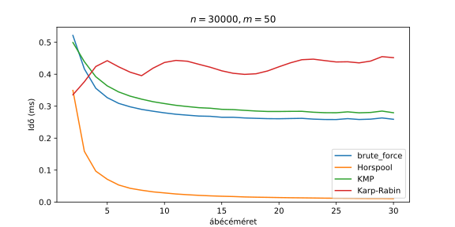
  Az algoritmusok futásideje az ábécéméret függvényében.

### 2-elemű ábécé

  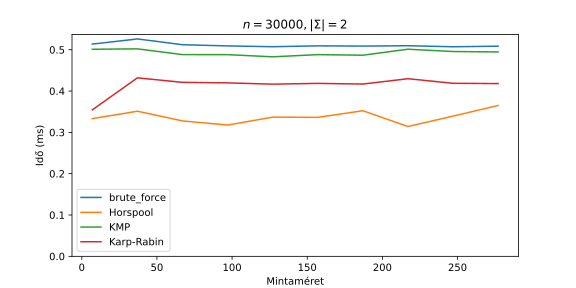

  

### 4-elemű ábécé

  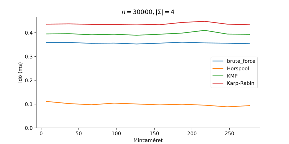

  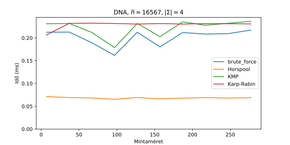

  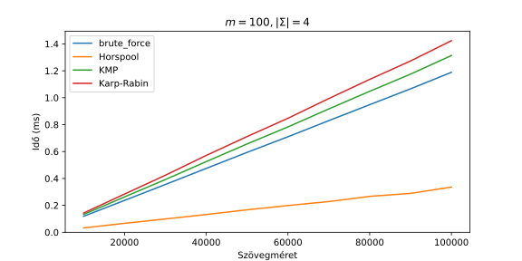

### 26-elemű ábécé

  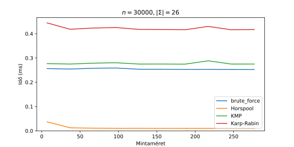

  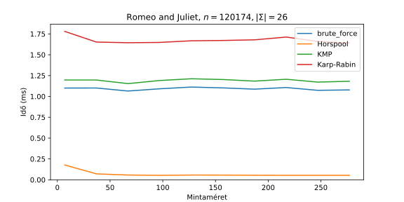

  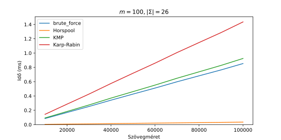

## Több mintát kereső algoritmusok
### 2-elemű ábécé

  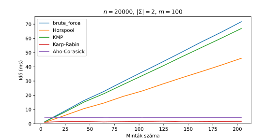

  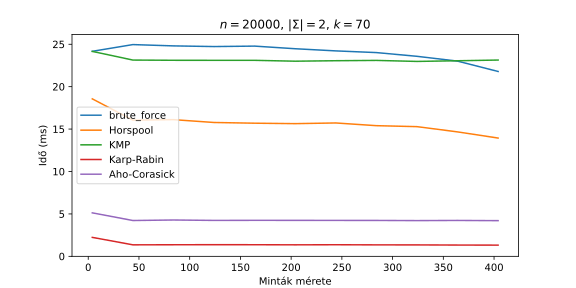

  

### 4-elemű ábécé

  

  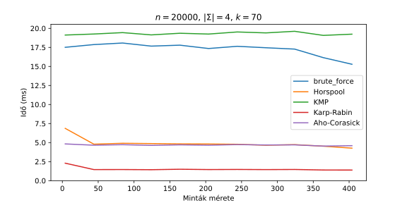

  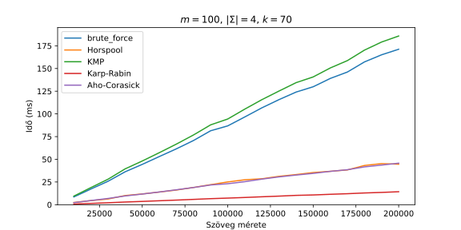

### 26-elemű ábécé

  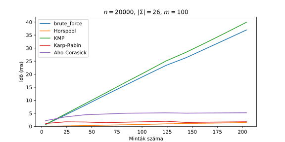

  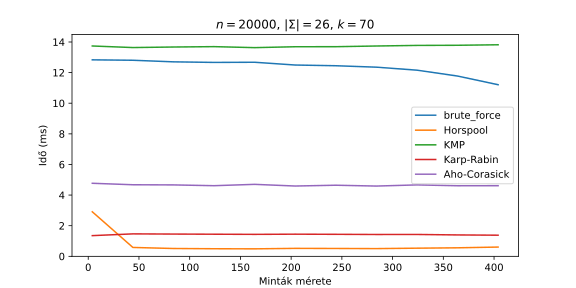

  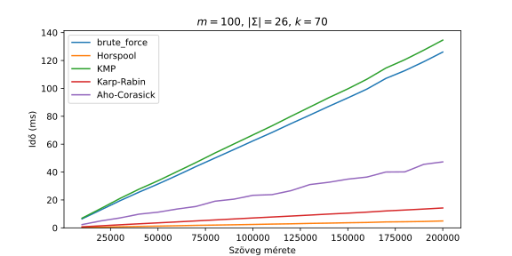

