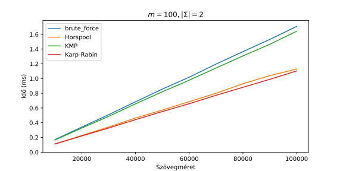
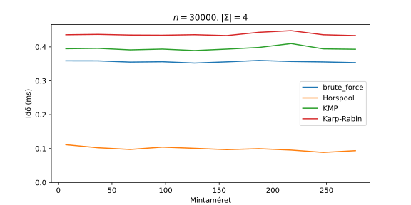
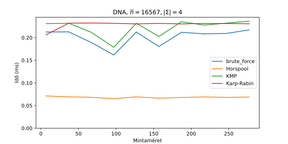
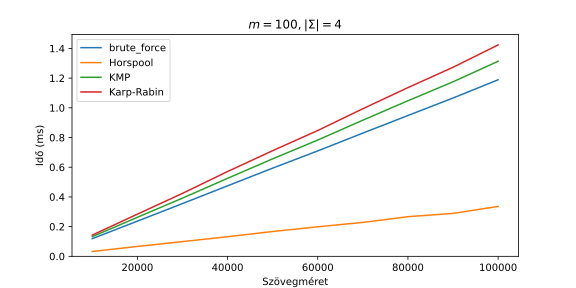
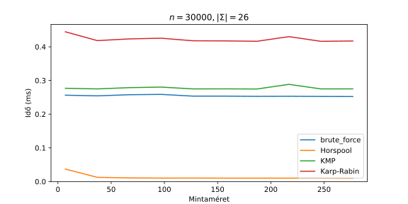
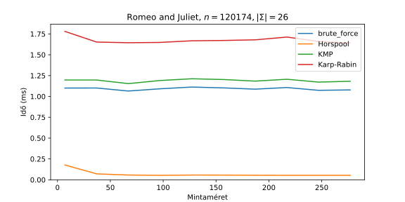
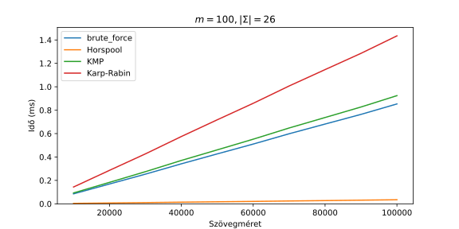

# Ábragenerálas
Automatizált ábragenerálás a szakdolgozatomhoz készült implementációk futásidejéről.
A futásidőket különböző ábécéméretek mellett is kipróbáltam:
- 2: gyakori, hogy bitsorozatokkal tárolnak információt
- 4: mivel a DNS szekvencia 4-féle nukleobázis (citozin (C), guanin (G), adenin (A), timin (T)) sorozata
- 26: az angol ábécé

**Tartalomjegyzék**
1. [Egy mintát kereső algoritmusok](#item-one)
   - [2-elemű ábécé](#item-one-a)

## Egy mintát kereső algoritmusok

  
  Az algoritmusok futásideje az ábécéméret függvényében.

### 2-elemű ábécé

  

  

### 4-elemű ábécé

  

  

  

### 26-elemű ábécé

  

  

  

