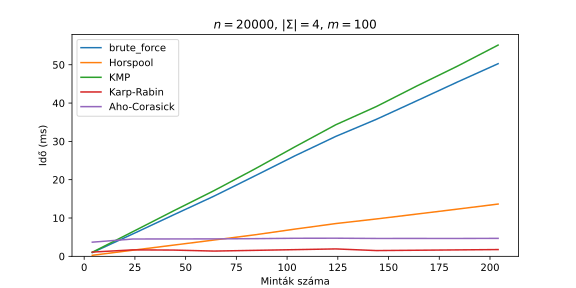

# Ábragenerálas
Automatizált ábragenerálás a szakdolgozatomhoz készült implementációk futásidejéről.
A futásidőket különböző ábécéméretek mellett is kipróbáltam:
- 2: gyakori, hogy bitsorozatokkal tárolnak információt
- 4: mivel a DNS szekvencia 4-féle nukleobázis (citozin (C), guanin (G), adenin (A), timin (T)) sorozata
- 26: az angol ábécé

<!-- TOC start (generated with https://github.com/derlin/bitdowntoc) -->

- [Egy mintát kereső algoritmusok](#egy-mintát-keres-algoritmusok)
  * [2-elemű ábécé](#2-elem-ábécé)
  * [4-elemű ábécé](#4-elem-ábécé)
  * [26-elemű ábécé](#26-elem-ábécé)
- [Több mintát kereső algoritmusok](#több-mintát-keres-algoritmusok)
  * [2-elemű ábécé](#2-elem-ábécé-1)
  * [4-elemű ábécé](#4-elem-ábécé-1)
  * [26-elemű ábécé](#26-elem-ábécé-1)
- [And a table of contents](#and-a-table-of-contents)
- [On   the right](#on---the-right)
- [Use the [TOC]](#use-the-toc)

<!-- TOC end -->

## Egy mintát kereső algoritmusok

  
  Az algoritmusok futásideje az ábécéméret függvényében.

### 2-elemű ábécé

  

  

### 4-elemű ábécé

  

  

  

### 26-elemű ábécé

  

  

  

## Több mintát kereső algoritmusok
### 2-elemű ábécé

  

  

  

### 4-elemű ábécé

  

  

  

### 26-elemű ábécé

  

  

  

## And a table of contents

will be generated

## On   the right

side of this page.

## Use the [TOC]

placeholder to control where the TOC will appear
